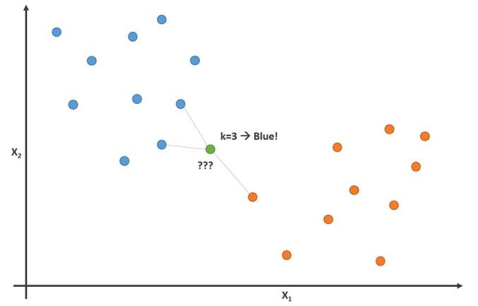

# K-Nearest Neighbors

## Chapter terms

* `k-nearest neighbors (k-NN/KNN)`: a *non-parametric classification* algorithm that can be used to assign membership of an item to a class by using a plurality vote of its neighbors ***or*** it can be used for *regression* such that the output is a value calculated by using the average of the values of *k* nearest neighbors.

When we use **KNN** for classification, we're really trying to find out how *similar* the points are to each other. One way we can do this is by using something called **feature extraction**. For example, we could calculate a distance measure for an input relative to all the other points and identify which points are closest and then assign it to the class with the most points closest to the input point.

However, this algorithm can be applied to *regression* problems as well using a similar method. Instead of using the closest `k` points to determine which class an input belongs, we would use the closest `k` points to calculate the *average* value (or some other statistic). Again, this measure of *closeness* is just a measure of similarity between all the points. It could be some other derived feature other than a distance calculation such as [cosine similarity](https://en.wikipedia.org/wiki/Cosine_similarity).

* `Feature extraction`: a process of deriving *new* values from an initial set of measured data intended to be informative and non-redundant such that generalizations and inferences can be made about a population.

One example of **feature extraction** is calculating the [Euclidean distance](https://en.wikipedia.org/wiki/Euclidean_distance) between points in n-dimensional space. So, for two points in 2-dimensional space, we would be using the [Pythagorean theorem](https://en.wikipedia.org/wiki/Pythagorean_theorem) to solve for `c`.

* `Machine learning`: the study of computer algorithms that improve through experience and from the use of data.

* `Optical character recognition (OCR)`: it's a type of **machine learning** that uses image recognition to identify characters and words.
